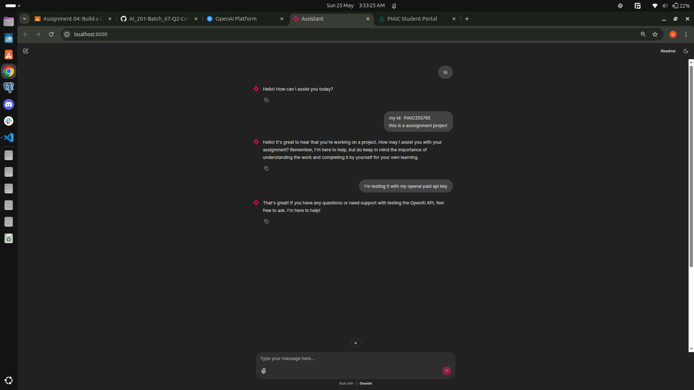

# 🤖 Chatbot with Chainlit & OpenAI Agent SDK

This project is a conversational chatbot built using [Chainlit](https://www.chainlit.io/) for the web-based interface and OpenAI's Agent SDK for natural language processing.

## 📷 Screenshot

### Chat Interface



## 💻 Setup Instructions

Follow the steps below to run the project locally:

```bash
# Clone the repository
git clone git@github.com:GMShahzaib/PIAIC.git

# Navigate to the chatbot project directory
cd Q2/chatbot-project

# Create a virtual environment using uv
uv venv

# Install the required dependencies
uv pip install openai python-dotenv chainlit

# Run the chatbot
chainlit run main.py
```

### 🔐 Environment Variables

Create a `.env` file in the project root directory and add your OpenAI API key:

```
OPENAI_API_KEY=your_openai_api_key_here
```

> Make sure **not** to commit this file to version control!