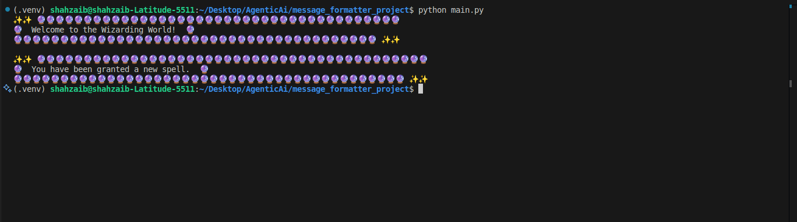

# Message Formatter with Decorators 🧙‍♂️

This project uses Python decorators to format messages with magical themes.

## Features
- `@mystic_border`: Adds a border made of mystical runes 🔮
- `@spellbound`: Surrounds the message with sparkly spell emojis ✨

## How to Run

1. Ensure you have Python installed.
2. Navigate to the project folder.
3. Run the demo script:

```bash
python main.py
```

## ✨ Example Output

